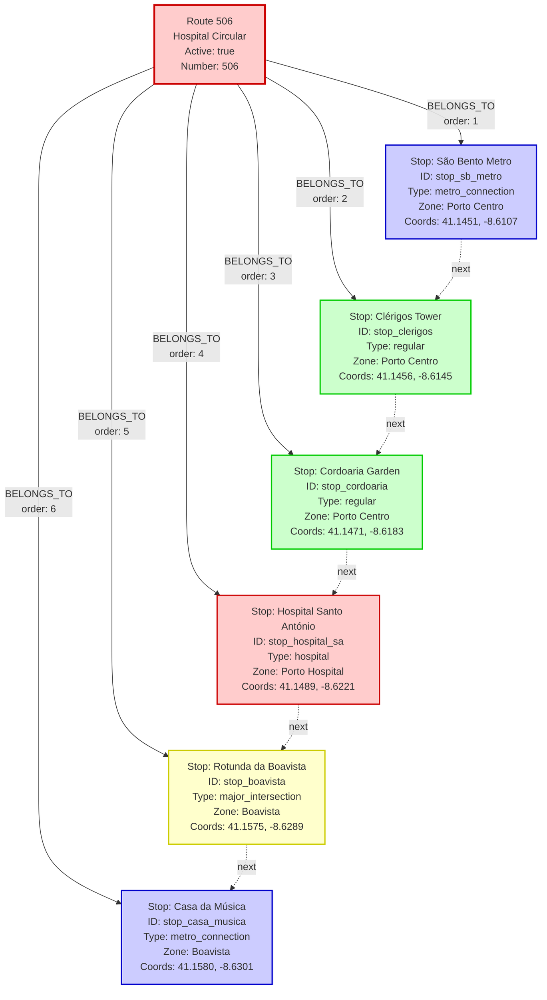

```mermaid
graph TD
    R506[Route 506<br/>Hospital Circular<br/>Active: true<br/>Number: 506]
    
    S1[Stop: São Bento Metro<br/>ID: stop_sb_metro<br/>Type: metro_connection<br/>Zone: Porto Centro<br/>Coords: 41.1451, -8.6107]
    
    S2[Stop: Clérigos Tower<br/>ID: stop_clerigos<br/>Type: regular<br/>Zone: Porto Centro<br/>Coords: 41.1456, -8.6145]
    
    S3[Stop: Cordoaria Garden<br/>ID: stop_cordoaria<br/>Type: regular<br/>Zone: Porto Centro<br/>Coords: 41.1471, -8.6183]
    
    S4[Stop: Hospital Santo António<br/>ID: stop_hospital_sa<br/>Type: hospital<br/>Zone: Porto Hospital<br/>Coords: 41.1489, -8.6221]
    
    S5[Stop: Rotunda da Boavista<br/>ID: stop_boavista<br/>Type: major_intersection<br/>Zone: Boavista<br/>Coords: 41.1575, -8.6289]
    
    S6[Stop: Casa da Música<br/>ID: stop_casa_musica<br/>Type: metro_connection<br/>Zone: Boavista<br/>Coords: 41.1580, -8.6301]
    
    R506 -->|BELONGS_TO<br/>order: 1| S1
    R506 -->|BELONGS_TO<br/>order: 2| S2
    R506 -->|BELONGS_TO<br/>order: 3| S3
    R506 -->|BELONGS_TO<br/>order: 4| S4
    R506 -->|BELONGS_TO<br/>order: 5| S5
    R506 -->|BELONGS_TO<br/>order: 6| S6
    
    S1 -.->|next| S2
    S2 -.->|next| S3
    S3 -.->|next| S4
    S4 -.->|next| S5
    S5 -.->|next| S6
    
    style R506 fill:#ffcccc,stroke:#cc0000,stroke-width:3px
    style S1 fill:#ccf,stroke:#00c,stroke-width:2px
    style S2 fill:#cfc,stroke:#0c0,stroke-width:2px
    style S3 fill:#cfc,stroke:#0c0,stroke-width:2px
    style S4 fill:#fcc,stroke:#c00,stroke-width:2px
    style S5 fill:#ffc,stroke:#cc0,stroke-width:2px
    style S6 fill:#ccf,stroke:#00c,stroke-width:2px
```

